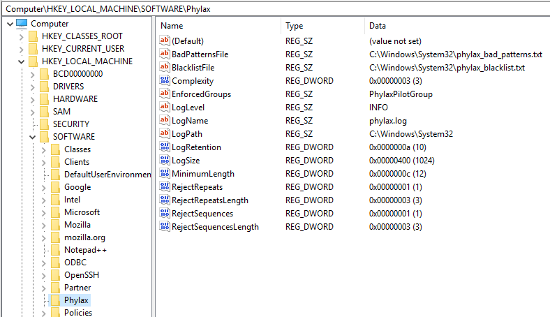

# Phýlax

**Greek** φύλαξ (phýlax)  
[800-500 BCE] Ancient Greece - Watcher, guard, sentinel, guardian, keeper, protector

## About

Phylax is a password policy add-in for Microsoft Active Directory. Any time a password is set, or changed, Phylax is called to check for blacklisted passwords or blacklisted patterns.

Technical reference: [Password Filters](https://learn.microsoft.com/en-us/windows/win32/secmgmt/password-filters?redirectedfrom=MSDN)

## Configuration

Phylax is highly configurable via self-reloading registry settings. The first time Phylax is run, the following default registry settings are created. 

These settings may be adjusted at any time, and the changes will be reloaded automatically. A check is performed every one minute for any changes.

### Default Registry Settings

#### Logging

|Setting|Description|Default|
|-|-|-|
|**LogLevel**|Setting the logging level (DEBUG, INFO, WARN, ERROR)|`INFO`|
|**LogPath**|Path to the log file|`C:\Windows\System32\`|
|**LogName**|Change the log file name|`phylax.log`|
|**LogRetention**|Number of log files to be retained|`10`|
|**LogSize**|Size (in kB) of log file before rotating|`10240` (10MB)|

#### Complexity Enforcement

|Setting|Description|Default|
|-|-|-|
|**Complexity**|How many categories (lowercase, uppercase, numeric, special) must be included in the password|`3`|
|**MinimumLength**|Minimum password length to be enforced|`12`|
|**RejectRepeats**|Reject repeated characters (`111`, `!!!`, `aaa`, `AAA`)|`1` (True)|
|**RejectRepeatsLength**|Length of pattern to be rejected|`3`|
|**RejectSequences**|Reject sequence of characters (`123`, `321`, `abc`, `bca`)|`1` (True)|
|**RejectSequencesLength**|Length of sequence to be rejected|`3`|

|Setting|Description|Default|
|-|-|-|
|**BadPatternsFile**|Location of "bad patterns" file.|`C:\Windows\System32\phylax_bad_patterns.txt`|
|**BlacklistFile**|Location of password blacklist file.|`C:\Windows\System32\phylax_blacklist.txt`|

## Contributing

If you would like to contribute to this project, please first open an issue with details on what you would like to contribute, and why. From there, we can discuss the proposed changes before opening a PR.
